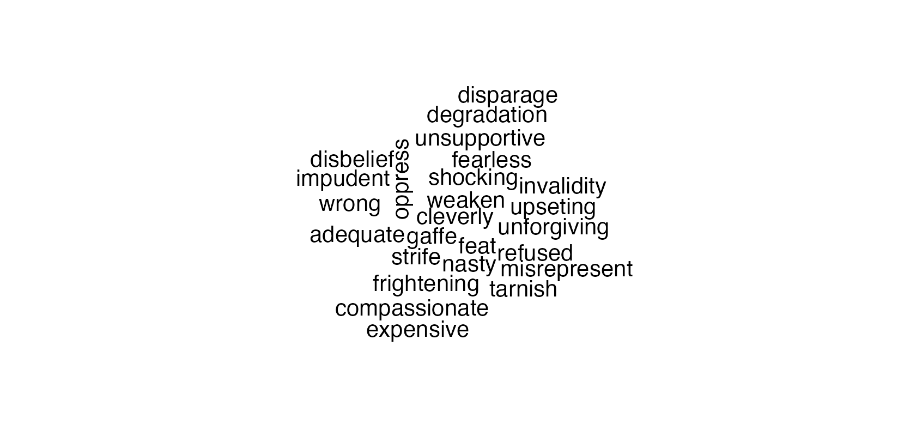

# Sentiment-Analysis
## Introduction
I have analyzed a dataset of numerous consumer narratives surrounding various financial institutions in the United States.  The goal is for any company / person in the US to be able to use this analysis to determine which banks are best for them and their banking needs.

## Dictionary 📖
1) dateRecieved: The date the company received the consumers narrative.
2) product: The specific aspect of the company that the narrative surrounded.
3) issue: Reason for the consumer narrative.
4) consumerComplaintNarrative: Consumers own words on what went wrong.
5) company: Financial institution in question.
6) state: State where consumer narrative was filed.

## Data Cleaning 🧹
1) Reading the file
* Since the file was 255 MB I converted it into an RDS
```r
rds_data <- read_rds("data/sentiment_data.rds")
```
2) Column Names
* I renamed all of the columns into camelCase for consistency
```r
rds_data <- rds_data %>%
  rename(dateRecieved = Date.received) %>%
  rename(dateSentToCompany = Date.sent.to.company) %>%
  rename(subProduct = Sub.product) %>%
  rename(subIssue = Sub.issue) %>%
  rename(submittedVia = Submitted.via) %>%
  rename(consumerComplaintNarrative = Consumer.complaint.narrative) %>%
  rename(companyPublicResponse = Company.public.response) %>%
  rename(zipCode = ZIP.code) %>%
  rename(consumerConsentProvided = Consumer.consent.provided.) %>%
  rename(companyResponseToConsumer = Company.response.to.consumer) %>%
  rename(timelyResponse = Timely.response.) %>%
  rename(consumerDisputed = Consumer.disputed.) %>%
  rename(complaintId = Complaint.ID) %>%
  rename(issue = Issue) %>%
  rename(product = Product) %>%
  rename(company = Company) %>%
  rename(state = State) %>%
  rename(tags = Tags)
```
3) Removing potential skews
* There was a lot of X's in the consumerComplaintNarrative where things were edited for privacy
* Some blank cells were found throughout the dataset so I replaced those with NA
```r
rds_data <- rds_data %>%
  mutate(consumerComplaintNarrative = gsub("X", "", consumerComplaintNarrative))
  
rds_data[rds_data == ""] <- NA
```
4) Clean and export to RDS
```r
clean_rds_data <- rds_data %>%
  select(dateRecieved, product, issue, consumerComplaintNarrative, company, state)

write_rds(clean_rds_data, "data/clean data/clean_rds_data.rds")
```
## Data Analysis
1) Companies Performance by State


* To chart this I used the afinn sentiment database and summed all of the scores together and applied a log scale to the sum of each companies score in every state
* We can see that the states with the worst sentiment ratings for their financial institutions are CA, IL, TX, NY, FL, GA, AL

2) Companies Performance by Month


* To chart this I took the total amount of complaints received in each month to create the initial bar chart.  To color each bar chart I then used the afinn database to get a sentiment score and colored each bar chart in based on the severity of its sentiment. Lighter shades of blue indicate worse consumer narratives and darker shades of blue indicate less negative consumer narratives
* July, August, September, and October have the most total consumer narratives
* March, May, and June have the most negative consumer narratives
* April, August, September, and October have the least negative consumer narratives

3) Word Cloud


* The general sentiment surrounding these financial institutions performance is overall negative with words like "haphazard", "craziness","faltered", and "loathing", etc. occuring at a significant rate

4) Best Performing Financial Institutions

| Company       |Sentiment Score|
| ------------- | ------------- |
| Freedom Mortgage| 598         |
| Great Lakes   | 588           |
| Marlette Funding, LLC| 88     |
| Impac Mortgage Holdings, Inc.| 81|
| Banco Popular North America| 71|

5) Worst Performing Financial Institutions 

| Company       |Sentiment Score|
| ------------- | ------------- |
| Equifax| -33037         |
| Experian   | -29484           |
| Bank of America| -27840     |
| TransUnion Intermediate Holding, Inc.| -24029|
| Wells Fargo and Company| -23256|

## Code for ggplots and tables (found in sentimentAnalysis.r)

1) Companies Performance by State

```r
output$plot_01 <- renderPlot({
    ggplot(sentiment_company_by_state_scores, aes_string(x = input$X, y = input$Y)) +
      geom_col() +
      labs(title = "Financial Institutions Performance by Month and State")
```

2) Companies Performance by Month

```r
output$plot_03 <- renderPlot ({
    ggplot(issues_by_month) +
      geom_col(mapping = aes(x = month, y = numIssues, fill = sentiment_month_scores$log_month_score)) +
      scale_x_discrete(limits = c("Jan", "Feb", "Mar", "Apr", "May", "Jun", "Jul", "Aug", "Sep", "Oct", "Nov", "Dec")) +
      labs(y = "Number of Issues", x = "Month", color = "Log Sentiment Score", title = "Severity of Issues by Month")
```

3) Wordcloud

```r
output$plot_02 <- renderPlot({
    consumer_sentiment %>%
      anti_join(stop_words) %>%
      count(word) %>%
      with(wordcloud(word, n, max.words = 25, scale = c(1.75, 0.1)))
```

4) Best Performing Financial Institutions

```r
best_company_scores <- sentiment_company %>%
  group_by(company) %>%
  summarize(sentiment_score = sum(value)) %>%
  arrange(sentiment_score) %>%
  tail(n = 5)
  
best_company_scores$log_company_score <- log(abs(best_company_scores$sentiment_score))
```

5) Worst Company Scores

```r
worst_company_scores <- sentiment_company %>%
  group_by(company) %>%
  summarize(sentiment_score = sum(value)) %>%
  arrange(sentiment_score) %>%
  head(n = 5)
  
worst_company_scores$log_company_score <- log(abs(worst_company_scores$sentiment_score))
```

## Conclusion
1) There is an overall negative sentiment towards these financial institutions
2) CA, TX, FL, AL, IL, GA, NY are the overall worst performing states in terms of consumer sentiment
3) March, May, and June are the worst performing months in terms of consumer sentiment
4) This information can help be a huge help for businesses's and ordinary people alike better plan their financial futures whether it be when or where they make their transactions
